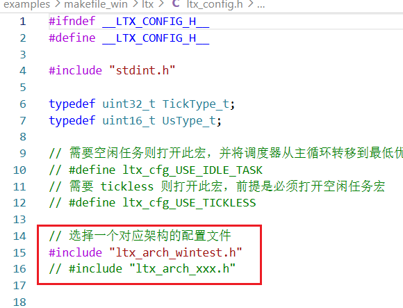
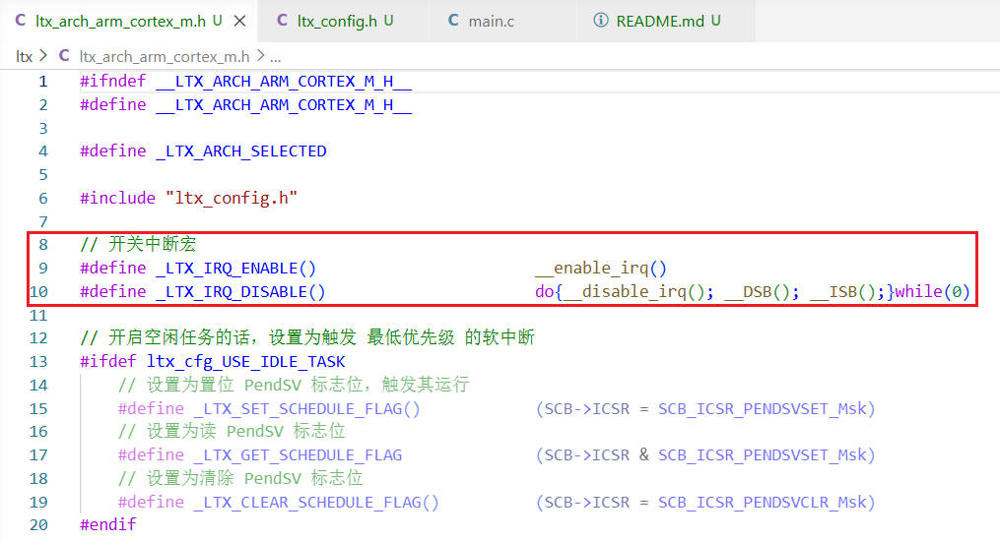
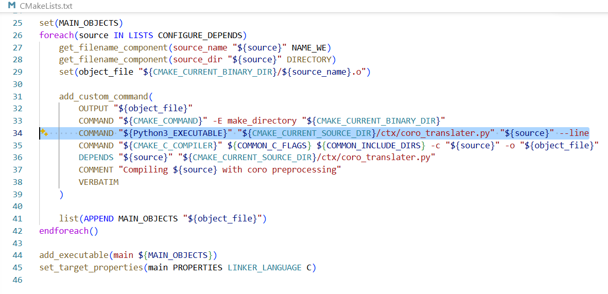
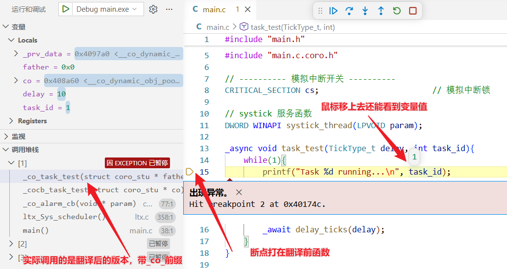

# windows 下的 cmake 例程

## 一、效果

创建四个任务以不同的方式与不同的事件位来等待事件组并设置超时时间，  
创建一个事件发布者任务在不同的时间发布不同的事件位。

需要注意，新版为了不给事件组额外创建任务不动态分配内存，事件与 的返回值将会是还未触发的事件而不是已触发的事件！  
例如 **与等待** `1011`，但是只触发了 `0110`，那么返回值将会是 `1000 0000 0000 0000 0000 0000 0000 1001`（最高位为 1 代表超时）  

或等待则保持返回已触发的事件  
例如 **或等待** `1011`，触发了 `0110`，那么返回值将会是 `0010`

## 二、部署过程

### 1、移植 ltx 调度器

打开 ltx 文件夹下的 `ltx_config.h`



配置为您所使用的架构  
如果暂时没有您所使用的架构，那么也不需要花太多功夫，不使用空闲休眠的话只需要指定出入临界区宏即可



然后将提供您平台的获取时间戳 `ltx_Sys_get_tick` 宏

```c
// 系统时间戳获取，需要注意，win 下毫秒时间戳会有十几毫秒误差，所以有些时候闹钟的响应不会那么准，这不是 ltx 的问题
#define ltx_Sys_get_tick()                  (TickType_t)GetTickCount()
```

最后将调度器 `ltx_Sys_scheduler` 函数放在 main 函数最后

### 2、配置编译前钩子

确保每个 c 文件在编译前都会生成对应的 `xxx.c.coro` 与 `xxx.c.coro.h` 文件（如果内部检测到 _async 关键字的话）



第一次编译时会处理所有 c 文件，会比较慢，后续增量更新则不会检查没更新的 c 文件。

似乎可以让 cmake 直接检查 .c 文件内是否包含 _async 关键字，然后决定是否要执行 python 脚本，这样会比每次编译 .c 文件都启停 python 进程更高效

## 三、其它

因为编译顺序问题，第一次编译可能会因为还没有生成 `xxx.c.coro.h` 文件，所以会报错部分函数与对象未定义，此时再点击一次编译即可

通过开启翻译脚本的 `--line` 选项，可以在调试时直接跳转到翻译前的代码，便于调试。但是因为翻译前后代码长短可能不同，所以可能会有走过头的情况，未来可能会优化相关翻译逻辑。


