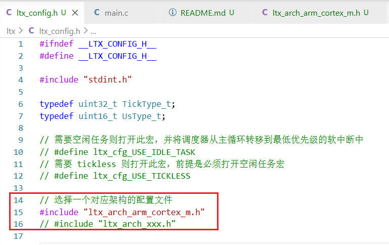
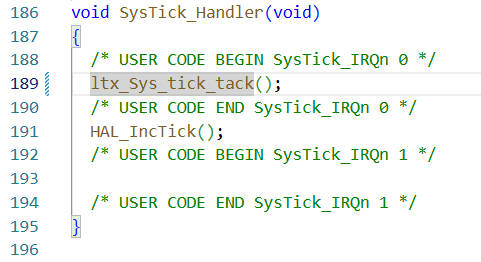
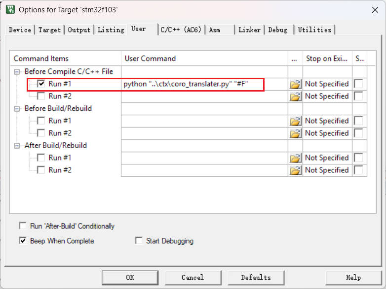

# KEIL5 环境下的 STM32F103 ctx 例程

## 一、效果

PB7: led0  
PB8: led1  
PB9: led2  

PB12: 按键

开机时，led0 会快速闪烁三次，此时是同步阻塞直接调用 `led_blink`

闪烁后，会创建两个异步任务，异步运行 `led_blink`，led0 与 led1 以不同频率闪烁 50 次互不干扰  

还会创建一个按键处理任务，异步等待按键按下  
按下按键后，led2 会闪烁 3 次

按键引脚为中断引脚，按下按键后，中断服务函数将消抖闹钟计时重置，所以会在不抖动 15ms 后闹钟触发，发布按键变化事件

## 二、部署过程

### 1、移植 ltx 调度器

打开 ltx 文件夹下的 `ltx_config.h`

配置为您所使用的架构  
如果暂时没有您所使用的架构，那么也不需要花太多功夫，不使用空闲休眠的话只需要指定开关中断宏即可

然后将 `ltx_Sys_tick_tack` 函数放在系统嘀嗒中断服务函数内

最后将调度器 `ltx_Sys_scheduler` 函数放在 main 函数最后

### 2、配置编译前钩子

确保每个 c 文件在编译前都会生成对应的 `xxx.c.coro` 与 `xxx.c.coro.h` 文件（如果内部检测到 _async 关键字的话）

第一次编译时会处理所有 c 文件，会比较慢，后续增量更新则不会检查没更新的 c 文件。

## 三、其它

因为编译顺序问题，第一次编译可能会因为还没有生成 `xxx.c.coro.h` 文件，所以会报错部分函数与对象未定义，此时再点击一次编译即可

还有 keil 环境似乎对 `#line` 宏的支持不太好，所以调试的话还是要看 coro 文件，，，
